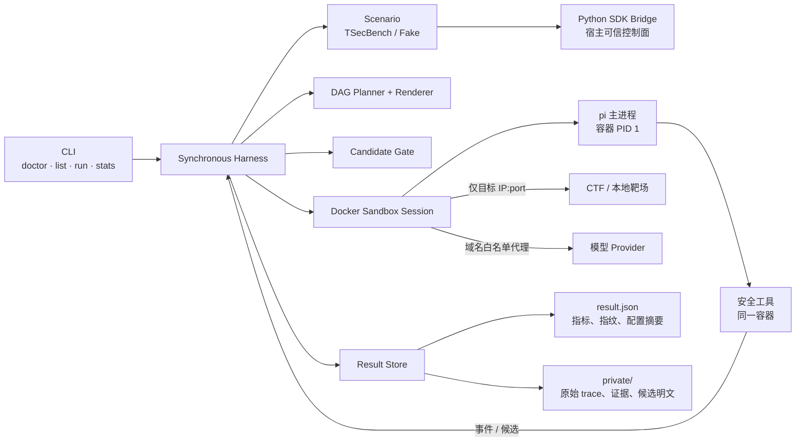

# red-harness v0.4 研究型 Offensive Security Harness

## 总结

将项目从“发布级、可恢复的单机产品”调整为“单 Agent、通过率优先的 CTF/本地靶场研究 Harness”。

v0.4 直接做破坏性升级：不实现 v0.3 尚未落地的暂停恢复、control socket、Web、公开报告和事件重放；保留已经验证过的 bridge、DAG、候选 gate、pi RPC 与 Docker 隔离能力，优先打通真实求解闭环。

同时修正当前最关键的架构断链：pi 必须作为 Docker sandbox 的主进程运行，Agent 的所有工具调用天然发生在容器内，不允许宿主 `exec.Command(pi)` 成为生产路径。

## 目标架构

核心约束：

- Harness 使用同步 `Run`，一道题一个 sandbox、一个 pi 会话，题目串行执行。
- Engine 的事件消费仍保持单写者；Agent reader 只向有界 channel 推事件。
- Docker sandbox 创建独立网络，并以有上限的 tmpfs 提供 `/work`、`/tmp` 和 Agent HOME；不再 bind mount 可写宿主工作目录。
- pi 作为容器主进程启动，stdin/stdout 直接承载 RPC；停止容器即可靠终止 pi 及工具子进程。
- 平台 token 只存在于宿主 bridge；模型凭据仅注入 sandbox 主进程环境，不写入 RunSpec、argv、日志或结果。
- `Scenario.Reconcile` 保留，但只用于运行中不确定的平台写结果；不提供进程崩溃恢复。
- 启动新 Run 前取得全局单运行锁，并按 label 回收上次崩溃遗留的容器、网络和规则。

## 公共接口与行为变更

- 版本升级为 `v0.4.0-research`，不提供 v0.3 兼容层。
- 用同步入口替代 `Engine.Start/Resume` 和 `RunHandle`：
  - `Harness.Run(ctx, RunSpec) (RunResult, error)`
  - `Harness.Doctor(ctx) DoctorReport`
  - 结果查询和聚合由独立 `ResultStore` 提供。
- 删除 `Snapshot` 重放、pause/resume/cancel、Unix control socket、SSE、Web 和报告接口；CLI 收敛为 `doctor/list/run/stats`，运行中取消使用 `SIGINT`/context。
- 将 `Executor` 改造成真正承载 Agent 的 `Sandbox`：
  - `NewSession(ctx, SandboxSpec) (SandboxSession, error)`
  - `SandboxSession.Probe` 在同一镜像中执行版本检查。
  - `SandboxSession.Launch(ProcessSpec)` 只允许启动一个附着式主进程，并返回可读写、可等待、可强杀的 `ManagedProcess`。
  - `SandboxSession.Close` 幂等回收容器、网络、代理和防火墙规则。
- `AgentFactory` 必须接收 `SandboxSession`；`piai` 只负责构造 pi argv 和 RPC，不再自行选择宿主二进制。
- `RunSpec` 包含 scenario、targets、Agent、Sandbox、Solver Profile、预算、是否提交及结果目录；移除用户可直接关闭隔离或自行填写目标白名单的字段。
- Solver Profile 使用 JSON 描述并计算摘要，包含 system prompt、只读 extension bundle、Planner 参数和提示策略；profile 资源只读挂载到 sandbox。
- 默认候选策略：
  - `observed` 与 `derived` 均直接提交，以召回率优先。
  - `fabricated` 不提交。
  - 同一候选在单次 Run 内只提交一次；平台 duplicate 视为已确认。
- 连续两轮既无平台进度、也无新增宿主验证事实时定义为停滞；自动请求一次提示。提示后再次连续两轮停滞则放弃当前分支，调度未尝试 intent。
- retryable provider/进程故障允许重启 Agent 一次，并用 DAG 中的脱敏事实摘要恢复上下文；再次失败则结束当前题目并继续下一题。
- submit/start/close 出现结果不确定时先 `Reconcile`，确认未生效后才重试，禁止盲目重发。

## Roadmap

1. **M0：v0.4 契约与文档切换**
   - 将 [architecture.md](/root/red-harness/docs/architecture.md) 和 [roadmap.md](/root/red-harness/docs/roadmap.md) 改写为研究型边界，并新增冻结的 v0.4 设计说明。
   - 删除未实现的异步控制与恢复契约，定义同步 Harness、SandboxSession、ManagedProcess、SolverProfile 和 ResultStore。
   - 保留现有用户 CLI 改动中仍适用于 `doctor/list/run` 的输入校验，不覆盖或丢弃工作区改动。

2. **M1：真实隔离纵向闭环**
   - 重构 Docker 执行器，使 pi 成为容器主进程；使用有界 tmpfs 工作区和只读 profile bundle。
   - 接通 Fake Scenario → Sandbox → pi/stub → DAG/Gate → Evaluate → Cleanup。
   - 完成 TSecBench Scenario 与装配层，CLI `run` 可以串行执行未完成题目。
   - 出口门：stub pi 明确证明自身运行在目标容器而非宿主，且一次 fake 题目全生命周期成功。

3. **M2：通过率反馈循环**
   - 完成 profile 化 prompt/extension、事实摘要回灌、判错指纹回灌、停滞提示和分支切换。
   - observed/derived 自动提交，fabricated 拦截；错误候选不在本 Run 重提。
   - 加入一次 Agent 重启和上下文摘要恢复，以及 provider 零回合故障护栏。
   - 出口门：离线场景覆盖提示、重复候选、derived 命中、错误提交、重启恢复上下文和清理。

4. **M3：线上累计评估**
   - 每题写入 profile digest、模型、题目、开始/结束进度、确认 flag 数、完成状态、得分、成本、耗时、轮次、提示和失败分类。
   - `stats` 按 profile/model/challenge/category/date 聚合：
     - 主指标：挑战完成率、剩余 flag 的增量召回率。
     - 次指标：得分、成本、耗时、提示率、provider/执行失败率。
   - 部分完成题以起跑时剩余 flag 为分母，避免把历史进度算成本次能力。
   - 在线题目组成不同，只对重叠 challenge/profile 做直接比较；其余结果明确标记为描述性累计数据，不宣称因果提升。

5. **M4：延后项**
   - 暂不实现 Web、公开报告、崩溃续跑、远程 worker、多 Agent、数据库、通用真实资产和动作级审批。
   - 若未来进入产品化，再单独设计签名 scope、动作策略、持久化恢复和多用户控制面，不把这些能力重新塞入研究内核。

## 测试与验收

- 契约测试证明生产 `piai` 无宿主进程启动路径，AgentFactory 缺 SandboxSession 时构造失败。
- Docker 集成测试验证 pi 和工具都在容器内、rootfs 只读、工作区容量有界、CPU/内存/PID/墙钟限制生效、宿主目录及 Docker socket不可见。
- 网络测试验证仅授权目标和 provider 代理可达，其他目标、宿主监听端口及公网默认不可达。
- 生命周期测试覆盖正常完成、SIGINT、Agent 崩溃、平台错误和 cleanup 错误；所有路径均无遗留容器、网络或规则。
- 求解测试覆盖两轮停滞后只请求一次提示、observed/derived 提交、fabricated 不提交、duplicate 确认、单 Run 去重以及 Reconcile-before-retry。
- 泄漏测试用固定 canary，确保平台 token、模型 key 和候选明文不出现在 `result.json`、CLI 输出或 argv；原始 trace 仅位于 `private/` 且权限为 `0700/0600`。
- 指标测试验证部分进度分母、profile digest 分组和累计过滤。
- 合并门：`gofmt -l .`、`go build ./...`、`go vet ./...`、`go test ./... -count=1`、`go test -race ./... -count=1`；Docker 性质另跑 integration tag。
- 最终冒烟是在明确授权且 VPN 连通的 TSecBench 环境完成至少一道题的 `list→prepare→solve→submit→cleanup`，并确认所有 Agent 工具活动来自 sandbox。

## 假设与默认值

- 仅支持 Linux、Docker、单机单用户和单 Run；题目串行。
- 场景仅限 TSecBench、fake 和显式本地 CTF 靶场。
- 默认预算沿用 40 rounds、30 分钟、600 tool turns；提示阈值改为两轮停滞且每题最多一次。
- 文件系统是唯一结果后端；公开结果只存指标与指纹，原始研究 trace 不自动清理。
- 保留零第三方 Go 依赖、答案/事实分离、`answer.Fingerprint` 唯一真源、pi RPC 传输层和现有 bridge 映射契约。
- v0.4 的发布门是可信闭环、隔离真实性和指标完整性，不预设绝对通过率；通过率优化依据后续线上累计数据迭代。
