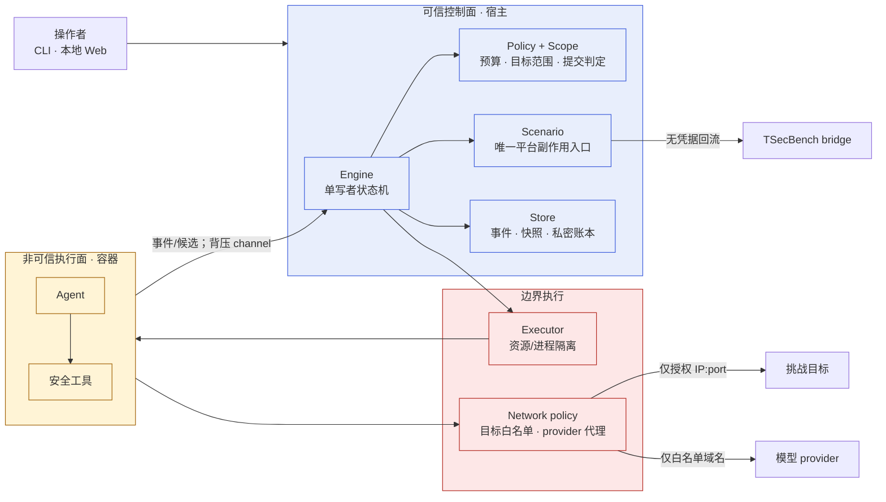
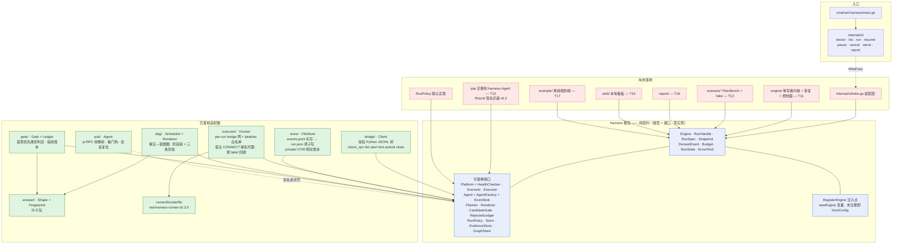
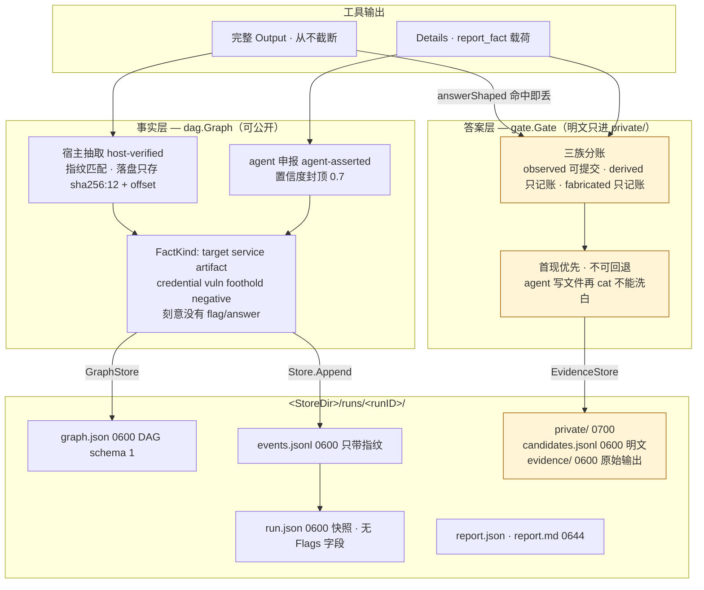
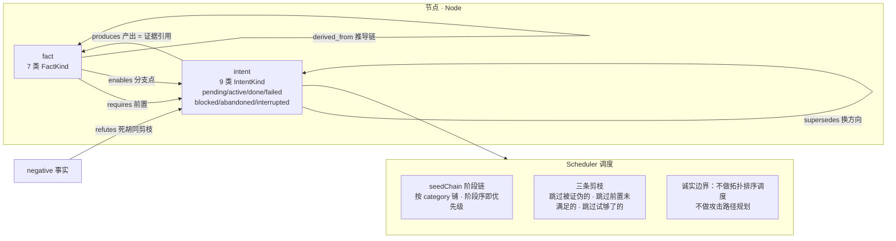

# red-harness 架构图（v0.3.0）

> 生成时间：2026-09-20
> 基线提交：`f799af3`（Merge branch 't10-cli'）
> 状态：**W0 + W1 已合并**（契约冻结、dag/gate 迁移、store、executor、bridge、CLI 骨架）；
> **W2/W3 未开始**（engine、scenario、piai 迁移、wire 装配层、report、web、example）。
>
> 图中**红色虚线框 = 尚未落地**；绿色 = 已落地且自测绿。
>
> 分阶段交付与出口门见 [roadmap.md](roadmap.md)。本文描述当前实现与目标接线，
> roadmap 描述先做什么以及何时算完成。

---

## 0. 架构结论与信任边界

red-harness 采用“**可信控制面 + 非可信执行面**”模型。Agent 与它调用的安全工具被视为
不可信代码；它们可以产出事件和候选，但不能决定授权范围、直接调用平台写接口、持有
平台凭据或写入公开运行状态。



五条架构约束：

1. **Engine 是唯一状态写者**；Agent、Web、Scenario 只能向它提交输入。
2. **Scenario 是唯一平台副作用入口**；写操作结果不确定时必须先 Reconcile。
3. **Executor 是最终执行边界**；prompt 和 Agent 自律不是安全控制。
4. **范围在容器外计算并强制执行**；Agent 只能看到解析后的目标端点。
5. **公开账本与私密账本物理分离**；任何跨界复制都必须经过指纹化或脱敏。

---

## 1. 分层与端口接线（当前真实状态）



**编译期依赖方向（实测，来自各包 import）**

| 包 | 导入的内部包 | 说明 |
|---|---|---|
| `answer` | — | 叶子 |
| `dag` | `harness`, `answer` | |
| `gate` | `harness`, `answer` | |
| `piai` | `harness` | |
| `bridge` | `harness` | |
| `executor` | `harness` | |
| `store` | `harness`, `answer` | |
| `internal/cli` | `harness` | |
| `cmd/red-harness` | `internal/cli` | |

**已有编译期契约断言**：`harness.Planner`/`Renderer`（`dag/schedule.go:37,428`）、
`harness.Executor`（`executor/docker.go:33`）、`harness.CandidateGate`/`RejectedLedger`
（`gate/provenance_test.go:527,524`）、`harness.Platform`/`HealthChecker`
（`bridge/client_test.go:29-30`）、`harness.Store`/`GraphStore`（`store/store_test.go:697-698`）、
`harness.EvidenceStore`（`store/private.go:324`）。
**缺断言**：`harness.Agent` / `AgentFactory`（piai 尚未迁移）。

---

## 2. 运行期轮循环（engine/ 的设计契约，T11 待实现）

```mermaid
flowchart LR
    A["Planner.Next<br/>取下一个可执行意图"] --> B["Renderer.Render<br/>渲染本轮 prompt"]
    B --> C["Agent.Round<br/>发 prompt · 等本轮结束"]
    C -->|EventSink 推事件| D["事件 channel · 有缓冲<br/>满了阻塞 = 有意背压"]
    D --> E["runLoop 单写者消费"]
    E --> F["Planner.ObserveEvent<br/>事实入图"]
    E --> G["Gate.Observe<br/>候选只记账 · 绝不 IO"]
    F --> H["Planner.Settle<br/>按客观产出回填"]
    G --> I["轮末 harvest<br/>Gate.New 取未提交候选"]
    I --> J["Scenario.Evaluate"]
    J --> P["Platform.Submit"]
    P --> K["Gate.Mark"]
    H --> L["Store.Append 领域事件<br/>→ 原子写快照<br/>→ GraphStore.PutGraph"]
    K --> L
    L --> M{"RunPolicy.OnRoundStart<br/>预算 / 进度 / ctx"}
    M -->|继续| A
    M -->|终止| N["Scenario.Cleanup<br/>Executor.Reclaim 按 run label"]

    classDef gap fill:#fde7e7,stroke:#b3261e,stroke-dasharray:4 3
    class A,B,C,D,E,F,G,H,I,J,K,L,M,N gap
```



**分支顺序是契约**（继承 v0.2，`harness.go:427 → 445 → 450 → 458 → 463`）：
`ctx.Err()` 判定必须先于 provider 护栏，否则一次零回合的墙钟超时会变成「模型服务挂了」。

**单写者不变式**：`runLoop` 是唯一改状态的 goroutine；全部输入（agent 事件、平台结果、
控制命令）走 channel 进 loop。状态变化**先追加带单调序号的领域事件**（`events.jsonl`），
**再原子保存快照**（`run.json`）——顺序不可颠倒。

---

## 3. 事实层 / 答案层双账本 + 存储布局



**硬规矩**：候选明文只允许存在于 `private/`（0700/0600）与返回值 `OutcomeView.Flags`。
`run.json` / `events.jsonl` / `graph.json` / `report.*` / 看板 HTML 一律只留指纹。

---

## 4. DAG 模型（dag 包，当前唯一有实质实现的核心）



六种边各自挣得一项能力：`requires`/`produces` 是执行契约，`enables` 是分支点，
`refutes` 是死胡同剪枝，`derived_from` 是推导链（provenance），`supersedes` 是换方向。

---

## 5. 现状要点

**已落地且自测绿**

| 包 | 关键实现 |
|---|---|
| `answer` | `Shape` 推断（envelope / 裸值）、`Fingerprint`（唯一真源，`fp:<hex8>/len=/<首>…<尾>`） |
| `dag` | 图 + 六种边 + `Scheduler`（阶段链 + 三条剪枝）+ `Renderer`（golden 测试）+ 落盘 schema 1 |
| `gate` | `Gate`（首现优先、三族分账、格式闸）+ `Ledger`（指纹账本） |
| `store` | `FileStore`（事件先于快照、撕裂末行修复、原子写、private 权限） |
| `executor` | `Docker`（argv 级隔离、per-run 网络 + iptables、宿主 CONNECT 代理、按 label 回收） |
| `bridge` | `Client`（JSONL 协议、handshake、崩溃重启、错误分类映射） |
| `piai` | `Agent`（pi RPC 帧解析、看门狗、会话复位、UI 对话框自动应答） |
| `internal/cli` | 8 个子命令骨架 + flag 解析 + control socket 客户端 |
| `runner` | `red-harness-runner:v0.3.0` 镜像（已真构建，digest 记录在 `runner/README.md`） |

**断链处（架构图里的红色节点）**

- `engine/` 整个包不存在 ⇒ `harness.New` 永远返回「引擎实现未注册」，`RegisterEngine` 无人调用。
- `internal/cli/wire.go` 不存在 ⇒ `cli.WireFunc` 为 nil，`app.ports()` 返回空 `Ports`，
  CLI 每个子命令都走「未实现」分支。
- `scenario/` 不存在 ⇒ 有 `Platform`（bridge）但没人把它适配成 `Scenario`，
  `Options.Scenarios` 无从填充。
- `piai.Agent.Round(ctx, prompt, emit)` 仍是 v0.2 签名，与 `harness.Agent.Round(ctx, RoundRequest)`
  不兼容，且无 `AgentFactory`；piai 里也没有 `var _ harness.Agent = ...` 断言，所以**编译绿但契约未对齐**。
- `RunPolicy`、`report/`、`web/`、`example/` 均无实现。

**一句话**：契约层与全部叶子适配器已完成，中间那层（engine + wire + scenario + piai 迁移）是空的
——这正是 W2 的四个任务（T11/T12/T13/T14）。

---

## 附：Mermaid 渲染

以上代码块可直接粘贴到支持 Mermaid 的渲染器（GitHub、VS Code 插件、mermaid.live）。
若需导出为图片：

```bash
npx -y @mermaid-js/mermaid-cli -i docs/architecture.md -o docs/architecture.png
```
