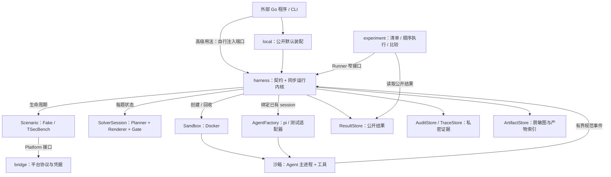
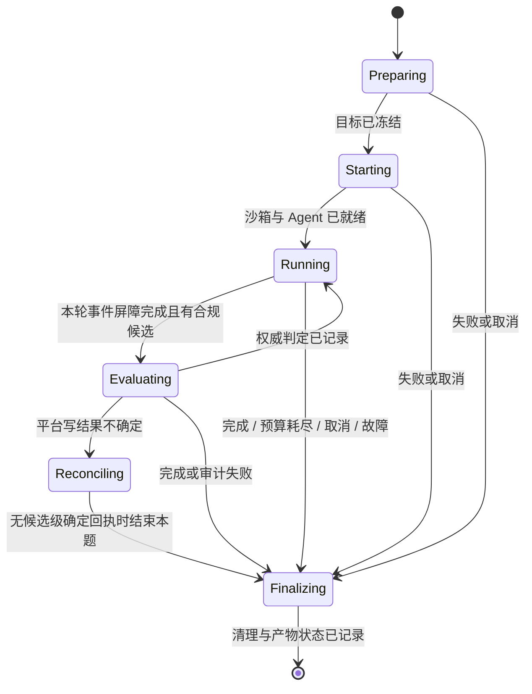

# Offensive Harness SDK 新架构设计

> 状态：设计提案，尚未实现。基线：2026-09-22，工作区 HEAD `178d47f`，同时参考工作区中尚未提交的 analysis 材料。
> 当前实现以 [architecture.md](architecture.md) 和源码为准；实施顺序与出口门见 [SDK roadmap](offensive-harness-sdk-roadmap.md#6-新架构实施路线n0n5)。本文不改变 R0 尚未通过、R1 离线部分已落地的发布状态。

核心决策：**保留同步 Harness 与单题单沙箱，把 SDK 的公开装配、运行内核、求解策略和研究数据分清；先建立可验证的单机 SDK，再考虑并发与恢复。**

## 1. 从 analysis 到设计决策

本设计使用 [拓扑观察](../analysis/red-harness/topology.json)、[调用图](../analysis/red-harness/call-graph.mmd)、[关键路径](../analysis/red-harness/critical-path.mmd)、[数据流](../analysis/red-harness/data-lineage.mmd) 和 [交互图](../analysis/red-harness/TOPOLOGY.html)。analysis 中的边同时包含实现能力、历史路径与生产接线，不能全部当作运行事实。

| 观察与源码核对 | 架构影响 | 处理阶段 |
|---|---|---|
| 拓扑把根包写成“零实现”，实际 `v04.go` 有 1,623 行，含契约、配置、编排、事件队列和摘要逻辑 | 根包维持零子包依赖；先按职责拆文件，不立即移动所有公开类型 | N1 |
| `internal/wire` 集中装配 7 个实现包；关键调用经接口注入，import 图不能证明接线 | 保留一个默认装配实现，公开为 `local`；显式构造替代 CLI 包级 `SetWire` | N0 |
| `example/main.go` 导入 `internal/wire` | 仓内示例不能证明外部 SDK 可用；外部模块需要公开装配入口与合同测试工具 | N0 |
| 数据图画出 `events.jsonl`、`run.json`、旧候选账本等写边，但当前生产没有相应调用方 | 活跃产物登记与 legacy 能力分开；不据旧事件文件宣称支持重放或恢复 | N0、N3 |
| `v04.go:appendAudit` 忽略 `AppendAudit` 错误；审计有独立大小限制、路径和 context 检查 | “审计失败必然导致结果保存失败”不成立；审计可用性必须独立报告 | N0、N2 |
| `Outcome.Submitted` 在当前循环中只对正确确认递增，Duplicate 是其子集；审计却记录每次 Evaluate | `submitted` 不能用作总请求数；新 schema 显式记录 attempts / accepted / rejected / uncertain | N2 |
| `defaultLock` 以 `StoreDir` 定位；`reclaimStale` 把仅当前 Run 作为 live 集合交给共享 Docker 扫描 | 按源码可推导：不同目录可绕过互斥，进而误判其他运行是孤儿；必须对齐锁与回收作用域 | N0 |
| `dagGraphSaver` 每题都向 `ForRun(runID)` 写同一份 `graph.json` / `graph.mmd` | 按写路径可推导：多题运行只保留最后写入的图；每题产物需要独立身份 | N0 |
| bundle 做摘要后仍挂载原目录，镜像 tag 身份在 Probe 后才记录 | 摘要只能证明读取时内容；要复现，需要执行被冻结的 bundle 副本与镜像身份 | N3 |
| 真实提交尚无解题确认；同桥流量隔离只有已知边界 | 保留生产发布门；新架构不能用 Fake、HTTP 200 或图上的连线替代证明 | R0、N4 |

上述锁、图路径、审计窗口来自静态核对，本次未执行攻击性探针或故障复现。阶段验收要把推导变成可重复证据。analysis 关于宿主 Python 缺依赖的记录也仅是历史环境观察，本设计不把它当成永久部署条件。

## 2. 产品边界与使用方式

主要用户及其完成任务的方式：

- **Agent 开发者**：通过公开默认装配跑一题，替换 AgentFactory，仍获得相同的事件、预算、候选和清理语义。
- **策略研究者**：替换 SolverFactory 或 profile，对固定题目集做重复实验，比较完成率、增量进度、成本和故障。
- **平台接入者**：实现 Scenario，运行同一套生命周期合同测试；平台错误与解题结果分开。

v1 的部署边界仍为 Linux + Docker、单机单用户、串行 Run / 串行题目、文件后端、明确授权的 CTF 和靶场。默认随库提供 Fake、TSecBench、pi、DAG 与 Gate 实现。

不在本轮建立 Web 服务、远程调度、通用工作流 DSL、动态插件注册中心或跨语言 SDK。新的可插拔点必须由实际适配需求驱动；第二种 Agent 用于验证接口不绑定 pi，不意味着立即维护多个生产 Agent。

## 3. 目标组件与依赖



图中是运行调用方向；编译依赖仍为：实现包 → 根包，`local` → 根包与实现包。根包不 import 子包。`experiment` 仅依赖根包，不负责 Docker 或平台装配。

### 3.1 包布局与迁移方式

```text
harness/（模块根包，保持现有 import 路径）
  model.go / ports.go / errors.go      稳定领域类型与端口
  harness.go                          同步门面、Run 互斥与总结果
  config.go / manifest.go              纯配置解析、有效配置与身份
  challenge.go / lifecycle.go          单题状态、资源获取与收尾
  round.go / event_stream.go           轮次、事件消费、水位屏障
  submission.go / finalization.go      提交协议、终态与持久化
local/                                公开默认装配，接替 internal/wire
internal/cli/                         参数与输出；构造时注入 Runner 工厂
dag/ gate/ answer/                     保留实现和唯一指纹来源
executor/ piai/ scenario/ bridge/       保留现有适配器包路径
store/                                保留文件实现，显式实现各存储端口
experiment/                           顺序实验执行与比较
harnesstest/                          供第三方使用的端口合同测试
legacy/                               历史读写与旧接口；不新增生产调用
```

先拆同包私有实现，可以保持 `harness.NewHarness`、`Harness.Run` 与第三方端口实现可编译。暂不引入 `core` / `api` 两个新包：否则根包门面、类型和内核搬迁容易产生循环依赖，且当前收益不足以抵消迁移成本。

`local` 是唯一默认装配包。迁移期间 `internal/wire` 只做薄转发，之后移除；同步修改 `legacy/layering_test.go` 的白名单，不能为了让测试通过而删掉依赖约束。允许外部程序自行装配，仓库“一个装配点”的约束针对默认实现，不禁止 SDK 用户组合公开端口。

### 3.2 SDK 入口

保留低层入口 `NewHarness(HarnessOptions)`；新增 `local.New(local.Options)`，返回提供 Run、Doctor、DefaultSpec、Results 与 Close 的 Runner。以下是**目标 API 示意，当前不可编译**：

```go
r, err := local.New(local.Options{StoreDir: "./runs", Scenario: local.ScenarioFake})
if err != nil {
    return err
}
defer r.Close()
spec := r.DefaultSpec()
spec.Submit = true
result, err := r.Run(ctx, spec)
// result 包含私密内存数据；面向终端与共享文件使用公开结果视图。
_ = result
return err
```

公开构造器只接受配置和凭据来源引用，不把凭据值写进可序列化 Options、RunSpec 或 manifest。完整示例需展示 Doctor、错误分类和公开结果读取；通过仓外独立 go.mod 构建，不能只验仓内 example。

`local.New` 可检查本地依赖并创建本地存储，不起靶场或 sandbox；`Run` 在配置验证后才获取租约和执行平台副作用。CLI 与 SDK 共享同一有效配置解析函数，不能分别维护默认值。

运行意图按“显式 RunSpec → 部署默认 profile → 内置默认值”解析；用可区分未设置与显式零值的输入表示，不能靠整个结构体是否全零决定合并。部署资源上限只能收紧，冲突时报错。目标出站集合仍唯一来自 Scenario.Prepare，经宿主解析冻结；RunSpec 与 Agent 都不能追加授权目标。Provider 域名白名单属于部署配置，不与题目目标混用。

### 3.3 端口调整

| 边界 | 目标设计 | 迁移策略 |
|---|---|---|
| Solver | 单个 SolverFactory 为每题创建 SolverSession，明确拥有 Planner、Renderer、Gate 与可选 Snapshot 能力 | 先适配现有 `SolverWithProfile`；删除工厂优先级链安排在下一个明确的破坏性版本 |
| Agent | 保留 Start / Round / Steer / Stats / Close 与“只能绑定已有 sandbox”的约束 | pi 细节留在 piai；通用 Probe 报 runtime 名、版本、协议能力，兼容旧 PiVersion 字段 |
| 事件 | 引入带上下文和错误返回的事件写入口，以及 round/session 身份与序号 | 新版本接口或适配器迁移；不悄悄改变现有 `EventSink.Emit(Event)` 方法集 |
| 存储 | Options 显式接 Results、Traces、Audits、Artifacts | 初期保留从 Results 类型断言的回退并发出弃用提示；严格模式要求显式审计 |
| 图 | Solver 导出脱敏 Snapshot，ArtifactStore 按 Run + Challenge + Attempt 保存 | 去掉 wire 里按 challenge code 登记活图的旁路；保留旧图读取 |
| 平台 | 保留 Scenario 六方法；按实际需要增加可选操作回执查询能力 | 不要求 TSecBench 凭空实现幂等键或候选级查询；缺能力时保持 uncertain |
| 结果 | 增加有版本的 PublicRunResult / PublicChallengeResult | 保留私密 RunResult 返回值；旧字段语义不原地重定义 |

## 4. 运行内核：状态与资源各有归属

### 4.1 配置与资源范围

一次 Run 分为三个阶段：

1. **Validate / Resolve**：纯校验、类型化配置合并、读取并验证 bundle；得到 EffectiveSpec。未知键、冲突配置和不可读 bundle 在获取运行锁之前失败。
2. **Acquire / Freeze**：取得与 Docker daemon / 共享宿主网络作用域一致的独占租约；创建 run 目录、bundle 快照、镜像固定身份；持久化准备记录；按所有权回收遗留资源。
3. **Execute / Finalize**：Discover，逐题执行，完整收尾，保存公开结果，最后释放租约。

N0 最小改动是让同一支持部署范围中的 Runner 共享固定锁位置，不随 StoreDir 改变。Docker endpoint 身份需要规范化，不能简单用用户输入字符串当锁身份。当前仅支持本机 daemon；远程 daemon 必须拒绝或另行设计协调机制。

资源标签包含 owner、runID、challengeID、attemptID。回收只能在取得对应独占租约后，处理同 owner 下被证明非活跃的资源；外来 owner、无法证明的旧资源只报告待处理。换目录不等于新的执行权限域。后续若允许并发，再引入活跃租约表与 fencing，不能沿用“live 集合只有自己”。

### 4.2 单题状态机



每题的 challengeSession 持有 sandbox、Agent、SolverSession、事件流、预算、候选账本和收尾栈。全 Run 只共享不可变配置、运行身份、存储句柄与跨题聚合结果，不共享可变 Planner/Gate。

正常轮次顺序固定为 `Next → Render → Round → Barrier → Stats → Settle → Evaluate → Reconcile → 停滞策略`。取消检查先于预算和 provider 分类。重启 Agent 创建新 session epoch；Turns / Cost 跨 epoch 累加，旧会话迟到事件不得落进新轮。

结束顺序显式实现为：停止产生新工作 → 有界停止 Agent → 排空或标记截断事件 → 冻结 Solver 快照 → 关闭 sandbox → Cleanup Scenario → 保存题目产物与结果。每个资源获取后立即登记对应清理动作；Prepare 已产生副作用但失败时，也要按平台能力对账和清理。

清理使用独立总时限，并给每一步留预算，前一步超时不能使后续步骤全部拿到已过期 context。退出原因、平台完成状态、cleanup 状态、audit 状态、artifact 状态分别存储；任何错误都不能把已经获得的平台确认改写成“未解出”。关键持久化失败返回 `KindPersistence`，同时返回已知结果。

### 4.3 事件所有权与背压

现有实现是一个事件消费 goroutine，加同步轮循环在屏障之后读取和更新状态；不是全状态只由一个 goroutine 修改。新内核采用显式所有权切换：

- Agent 适配器生成规范事件；宿主分配 `(run, challenge, attempt, sessionEpoch, round, seq)`，这些身份不能由 Agent 自述覆盖。
- 轮内只有消费者写入 Gate/Planner 的事件状态；轮末必须等到指定序号的 Barrier 完成，再由控制流程 Settle、提交和取快照。adapter 必须保证 Round 结束前该轮事件已经完成投递。
- 队列条数、总字节、单条大小和每轮总量都有上限；关键事件投递失败使本轮失败并可观测，禁止静默丢弃。日志/UI 观察者使用独立有界队列，丢弃可计数，不能阻塞控制流程。
- 私密 trace、审计、公共观察事件是不同的输出类型；原始 Event 不广播给公共 observer。任何图导出统一走 DAG 擦洗路径。

不在 N1 建立全系统 event sourcing。重放先限定为离线策略验证，不重新执行平台写操作、模型请求或工具命令。

## 5. 候选、事实与提交事务

### 5.1 数据域

| 对象 | 真源与责任 | 是否能直接公开 |
|---|---|---|
| Observation | 适配器提供的工具观察及出处；宿主验证标签由宿主产生 | 否，可能含答案或凭据 |
| Fact / Intent | Solver 的事实与计划投影；不包含答案实体 | 仅统一擦洗后的图或摘要 |
| Candidate | Gate 的私密候选及 observed / derived / fabricated 来源 | 否，只能公开指纹和计数 |
| Evaluation | Scenario 返回的权威判定 / 操作回执 | 只公开穷举状态和批准的指标字段 |
| Objective | 平台权威进度；与模型自述分开 | 可公开其计数、已知性与完成状态 |

保留 observed 与 derived 可提交、fabricated 不提交的现有行为。去重键明确为 `(runID, scenarioID, challengeID, candidateFingerprint)`，每题重启仍共用该题账本；不同题目可能合法接受相同字符串，不能用全 Run 的裸指纹阻断。`answer.Fingerprint` 保持唯一来源和旧格式兼容。

### 5.2 提交协议

当前 Evaluate 后追加一条审计，存在“平台已处理但本机尚未记账”的窗口。N2 引入私密的操作日志，不宣称本地文件与远端平台组成原子事务：

N2 的默认生产模式在 `Submit=true` 时要求 AuditStore 就绪，否则在平台副作用前拒绝运行；`Submit=false` 的观察模式可以不配置审计，但结果明确标记 disabled。TraceStore 与可选图不代替提交日志。

1. 检查来源、去重、取消与提交预算，分配 operationID；同步持久化 `prepared`（候选、目标、指纹、出处）。失败则不调用 Evaluate。
2. 在发请求前同步追加 `dispatching`，再 Evaluate。这个状态表示“可能已发出”，不是平台收到了的证明。
3. 将回执归一为 accepted / duplicate / rejected / uncertain，追加 `resolved` 或 `uncertain`；再更新账本与公开计数。
4. Evaluate 超时或断连先 Reconcile。总进度变大不能证明某个候选被接受；没有候选级回执就保持 uncertain，停止本题，禁止自动重提。
5. Evaluate 已返回但审计落盘失败：保留内存中的已知判定，设置 audit incomplete，停止后续提交并返回持久化错误；尽力保存公开失败摘要。不能假设另一个文件也必然写失败。

`dispatching` 后崩溃无法判断请求是否发送，恢复工具必须保守显示 uncertain。若平台未来支持幂等键或操作回执查询，可用 capability 接入；平台没有这些能力时不承诺 exactly-once。

“同步持久化”要求文件写入与 fsync 成功；新建日志及目录还要持久化目录项。读取时只容忍被截断的最后一条记录，中段损坏必须报告；不能跳过损坏后继续声称审计完整。审计检查工具只读对账，不因此开放崩溃续跑。

公开计数新定义：`attempts = accepted + rejected + uncertain`，`duplicates ≤ accepted`，`newConfirmed` 从权威进度增量计算，不能用 accepted - duplicates 推导多目标成绩。完整运行的 attempts 统计实际调用 Evaluate 的次数；崩溃记录仅能给出已知值和可能发送的数量，标记计数不完整。旧 `submitted` 按旧含义读取，不改名后复用其数值充当 attempts。

新日志每次操作有多行，验收按 operationID 归并，不能继续要求“审计行数 == 提交数”。读取旧单行 submissions schema 时，只能得到结果记录，不能伪造发送前持久化证据。

## 6. 存储、复现与实验

### 6.1 活跃存储布局

不强制合并 StoreDir 与 ResultDir，保持部署兼容；通过产物索引和稳定 ID 关联两棵树：

```text
<StoreDir>/runs/<runID>/
  manifest.json                           版本化的公开有效配置摘要
  artifacts.json                          每题产物、schema、摘要与写入状态
  challenges/<challengeID>/attempts/<n>/
    graph.json / graph.mmd                脱敏图，禁止裸题目名称作路径
<ResultDir>/results/<runID>.json           公开结果
<ResultDir>/private/<runID>/
  <challengeID>/<attemptID>/trace.jsonl    私密规范事件
  submissions.jsonl                      版本化私密操作日志
  bundle/                                实际执行的冻结副本
```

challengeID 由场景内稳定身份映射，不含原始目标地址或候选；路径严格校验。bundle 可能含私密研究资料，不作为公开下载产物。私密目录 0700、文件 0600；公开数据类型与原始内存结果分开序列化。

新 writer 只写新布局；reader 支持旧图 schema 和旧路径。旧 Run 根目录单份图无法恢复已覆盖的题目，迁移只登记实际存在的那份并标明旧布局。图是可选产物：`disabled / absent / saved / failed` 分开表示，Save 返回 nil 不再默认代表生成了文件。

### 6.2 冻结实验身份

EffectiveSpec 只解析一次，启动参数、Planner、预算和 manifest 均从它取值。分开记录“请求配置”和“实际执行身份”：

- Profile 内容、完整提示模板与 renderer 版本；bundle 文件清单、内容摘要及被冻结的副本。
- 请求镜像引用、实际固定的镜像身份、Agent runtime / 协议版本、SDK revision、Scenario adapter 版本。
- provider / model、预算、提示与重启策略、题目集及顺序、起跑权威进度、可用的场景快照身份。
- 镜像 tag 只用于查找，执行使用解析出的固定身份；bundle 从受控快照挂载。读复制期间若源变化，应重试或拒绝，不能记录 A 的摘要却运行 B。

RunID 表示一次执行；ExperimentID 表示一份实验计划；ExperimentDigest 表示可比较的有效配置内容。旧 ProfileDigest / BundleDigest 保留用于历史查询，新增带版本的摘要规则，不把本机绝对路径当实验差异。模型服务的随机性和可变靶场意味着“可重建实验条件”不等于“逐 token 重现”。

### 6.3 实验执行与指标

`experiment` 在 Harness 外部按固定清单串行执行重复试验，不改变内核并发模型。每个条目记录预期题目、profile、model、预算、重复编号、起跑状态与结果 RunID。若平台不能重置起跑进度，将该条目标为不可比较，而非静默跳过已经完成的题目。

比较输出至少包括：题目覆盖、题目完成率、增量召回率、成本、耗时、失败类别、提交尝试数与 uncertain 数。增量召回率分母未知时输出 null 和原因，不能输出 0；同时给出基础设施失败率，禁止用只过滤“成功运行”的分母制造提升。比较只使用匹配题目与起跑状态的配对样本，并报告排除原因和数量。

离线 replay 输入受限私密规范事件与冻结策略，只重建事实、候选和停止决策。它验证相同输入上的策略差异，不能证明改变提示后模型或靶场会产生同样行为。

## 7. 不变式、故障验收与拓扑证据

| 性质 | 必须经过的验收路径 |
|---|---|
| 外部 SDK 可用 | 仓外临时模块 import 根包 + local，完整构建；与 CLI 使用同一配置得到同一 manifest |
| 实现依赖受控 | 保留根包零子包依赖、实现包互不导入、legacy 叶子；仅 local 做默认装配 |
| 资源互斥与所有权 | 同 daemon、不同 StoreDir 的双进程争锁；另一运行不被回收；owner 不匹配拒绝删除 |
| 图不覆盖 | 一次 Run 两道题，各自图可读取且内容、产物身份匹配 |
| 事件有界且不会串轮 | 慢消费者、超大事件、取消、重启迟到事件、Barrier 并发；race 无冲突且终止有界 |
| 提交可追溯 | 在 prepared / dispatching / Evaluate 返回 / resolved 各处注入失败；不能无审计发送、盲目重提或吞写错误 |
| 公共面无明文 | 候选、key、平台响应、工具原文 canary 覆盖结果、图、observer、错误、manifest 与 CLI |
| 配置与执行一致 | 修改 bundle、替换 tag、未知字段、CLI/SDK 默认值冲突；必须拒绝或执行记录的固定副本 |
| 隔离与清理 | 生产 local 装配下真 Docker 正反探针；目标可达、非目标不可达；同桥边界单独实测并记录 |
| 平台解题闭环 | 真实 pi、授权 TSecBench、平台确认、清理与落盘；HTTP 成功码不能替代答案确认 |

拓扑边增加三个独立维度：`availability`（implemented / planned / legacy）、`wiring`（active / unwired）、`verification`（unit / container / platform / unverified），并记录源码符号、证据测试名和最近验证 revision。不能用一个“绿灯”同时表达代码存在、接线正确与平台已验。

提取器以后提供只检查不覆写的模式。CI 先检查活跃接线与产物的合同，再验证图中的证据引用；纯 regex 命中不能证明运行语义。当前工作区已有的 analysis 修改保留，本次设计不重生成或覆盖它们。

## 8. 关键取舍与后续决策

- **保留同步内核**：便于预算、错误和资源所有权推理；吞吐上限接受，先通过实验重复得到数据，再决定是否值得并发。
- **保留现有包路径**：同包拆职责优先；只有公开装配与必要的新合同引入新包。避免先搬目录再寻找收益。
- **审计在提交前持久化**：增加本地同步写延迟，换取“能证明哪些请求可能发生”；真实性优先于提交吞吐。性能指标在基线测量后确定，不凭空承诺 p99。
- **图和报告是派生产物**：单独报告缺失或失败；关键提交日志不可视为尽力而为的图导出。
- **通用目标模型渐进演进**：v1 保留 Challenge / Objective 的现有能力；资产评估、漏洞 Finding、动作级授权和多 Agent 协同另立设计，不把 flag 模型机械改名就称为通用 offensive 平台。

实施前仍需用最小原型确定：第二种 Agent 的具体候选、bundle 快照的体积上限、提交日志保留策略。默认采用本地文件、串行执行和现有平台；这些选择不阻塞 N0/N1。
