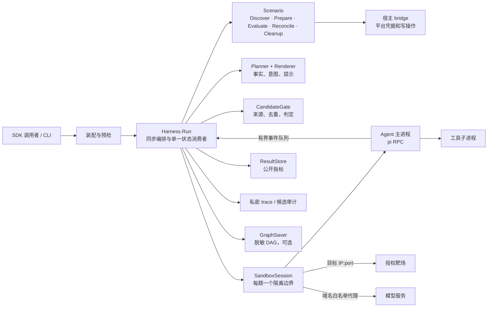

# Offensive Harness SDK：下一阶段架构与路线图

> 规划基线：2026-09-22。当前实现以 [architecture.md](architecture.md) 为准；v0.4 出口门以 [roadmap.md](roadmap.md) 为准。本文规划 v0.4 收尾及后续版本，不把尚未通过的发布门写成既成事实。

## 1. 产品定位与决策

SDK 服务于**明确授权的 CTF、TSecBench 和本地靶场研究**。首要用户是编写 Scenario、Agent 或求解策略的开发者；CLI 是同一套 SDK 的参考装配和验收入口。一次 `Harness.Run(ctx, RunSpec)` 同步执行，题目串行，每题一个隔离容器与一个 Agent 会话。

短期目标是让一次运行可安全执行、可解释地结束、可复算地比较。通过率是研究指标；授权范围、隔离、凭据、清理和指标真实性是发布条件。任何阶段都不以 Fake 成绩或旧 `Executor` 测试替代生产装配路径的验收。

| 决策 | 理由 | 后续变化条件 |
|---|---|---|
| 宿主控制面是唯一可信决策者 | 平台 token、授权目标、提交与权威进度不交给 Agent | 远程 worker 需另设计身份与通信协议 |
| `Scenario.Prepare` 给出可达目标，宿主解析并冻结 IP:port | 调用者或 Agent 不能扩大出站范围 | 通用资产必须先有可验证的授权清单与时窗 |
| Agent 与工具同在每题 Docker sandbox | 工具调用天然继承隔离和清理边界 | 更换隔离后端须通过相同性质测试 |
| 公共指标与私密证据分开 | 统计可分享，原始 trace、候选与凭据不可误入公开面 | 新结果后端须遵循同一序列化契约 |
| v0.4 不做崩溃续跑、并发题目、Web 或远程 worker | 先验证单机闭环与语义，再扩大状态空间 | 分别进入独立设计与验收阶段 |

## 2. 目标架构

### 分层与依赖

1. **根包 `harness`** 定义 `RunSpec`、`RunResult`、错误类别及活跃端口；编排只依赖端口。`Scenario` 映射平台语义，`Sandbox` 管隔离与生命周期，`AgentFactory` 绑定既有 session，`Planner`/`Renderer`/`CandidateGate` 管求解状态，`ResultStore` 管公开结果。
2. **适配器**：`scenario` + `bridge` 处理平台，`executor` 实现 Docker sandbox，`piai` 实现 pi RPC，`dag`/`gate` 实现策略，`store` 实现文件结果与私密 trace。适配器依赖根包，根包不反向依赖具体实现。
3. **装配层 `internal/wire`** 是默认值与生产配置的单一入口。它从 `DefaultDockerConfig()` 构造隔离配置，注入跨进程锁、结果存储、策略工厂与可选图保存器；装配断言与 Docker 集成测试都必须走这条路径。直接调 SDK 也必须满足相同必需端口和锁契约。

### 单题状态与副作用顺序

`Discover → Prepare → 冻结目标/配置 → NewSession → Probe → Launch/Start → [Next → Round → 消费屏障 → Gate → Evaluate → Reconcile] → Close Agent → Close Sandbox → Cleanup Scenario → Save Result`。

- `Run` 在任何平台或容器副作用前取得跨进程锁，并清理有标签的历史孤儿资源；取消先于预算和 provider 故障分类。
- 事件由有界队列传给唯一状态消费者。轮末屏障保证 Gate 和 DAG 看到完整的本轮事件后才提交候选。
- `observed`、`derived` 可提交，`fabricated` 不可提交；同一 Run 的同一候选不重复提交。平台写结果不确定时先 `Reconcile`，不能盲目重发。
- 平台权威进度决定是否解出；`State` 只描述运行如何结束，`Completed` 描述是否达成目标。清理和保存使用独立有界 context，清理错误另记，不覆盖主终态。

### 数据与信任边界

| 数据 | 所有者 / 落点 | 公共面规则 |
|---|---|---|
| 平台 token、provider key | 宿主 bridge / 受限传递；provider key 经临时 `0600` env-file 进入 sandbox | 不进入 `RunSpec`、argv、日志、结果 |
| 目标范围 | `Scenario.Prepare` 的权威目标，经宿主验证、冻结后交给 Sandbox | Agent、调用者不得附加白名单；默认拒绝其他出站 |
| 候选明文与原始 trace | 内存返回值及 `<ResultDir>/private/<runID>/`，目录 `0700`、文件 `0600` | 公开结果和脱敏 DAG 只含指纹、计数与枚举 |
| 公开结果 | `<ResultDir>/results/<runID>.json` | 只存结果、失败类别、成本、进度、配置摘要；不得直接序列化含 Flags 的 `RunResult` |
| 比较维度 | `ProfileDigest`、`BundleDigest`、model、scenario、challenge | bundle 内容变化须形成新实验分组；分母未知时召回率标记不可计算 |

Docker 宿主属于可信计算基。当前同一 Docker bridge 内流量不经过既有 iptables 规则，这一边界必须保留在部署文档和验收记录里；不能把当前隔离表述成对任意同桥容器也有效。

## 3. SDK 契约演进

**v0.4 保持现有生产入口**：`NewHarness(HarnessOptions)`、`Harness.Run(ctx, RunSpec)`、`Doctor(ctx)` 与独立 `ResultStore`。`Scenario`、`SandboxSession`、`AgentFactory` 等活跃端口以源码定义为准，不在收尾期为外观重写接口。

**v0.5 做一次明确的破坏性整理**，并提供迁移表：

1. 将 `SolverProfile.Planner` / `PromptPolicy` 的任意 `map[string]any` 改为带 schema 与范围检查的配置；冻结后的有效值、bundle 内容摘要和 runner 镜像 digest 一起记录为运行清单。未知键、非法值和不可读 bundle 在副作用前失败。
2. 明确 `OutcomeView.Flags` 仅为内存/私密返回值；定义私密候选审计记录（指纹、来源、意图、提交时间、平台判定及明文的受限引用），避免只有原始 trace 而无法回答“提交了什么、结果如何”。审计记录与公开结果分别序列化。
3. 清理双代公开面：给 v0.3 `Engine`、`RunHandle`、`New`、`RegisterEngine`、`Store`、`EvidenceStore` 和旧 `Executor` 标注 legacy；若无生产调用方，在 v0.5 迁移窗口移出根包。保留既有 `Reason*` 字符串、图 schema 读取能力和 `answer.Fingerprint` 唯一实现。
4. 对齐 `GraphSaver` 的实际能力与文档：图是可选研究产物，保存失败要记录为可比较的阶段枚举；公开图须经过 DAG 的统一擦洗路径。不要把图保存成功误当成运行成功。

## 4. Roadmap 与出口门

以下按依赖排序；状态以**可复现证据**为准，不以代码存在为准。阶段时间取决于授权平台和 provider 可用性，因此不预设日历日期。

| 阶段 | 优先级 / 当前状态 | 交付项 | 退出条件 |
|---|---|---|---|
| **R0：v0.4 发布门收尾** | P0 / 未通过 | 定位 TSecBench `submit` 的 `app_error (http 501)`；真实 pi 完成授权题生命周期 | 经生产装配完成 `list → prepare → solve → submit → cleanup` 至少一题；平台权威确认提交结果；无残留；公开结果与私密证据正确。若 501 是平台故障，记录最小脱敏证据并保持门未通过 |
| **R1：v0.5 SDK 契约与审计** | P0 / 待开始，依赖 R0 | profile schema、冻结运行清单、私密候选审计、legacy API 迁移、示例与迁移指南 | 编译期端口契约、配置拒绝用例、候选审计对账、公开面 canary 和旧图读取回归通过；CLI 与直接 SDK 调用同口径 |
| **R2：可重复研究基线** | P1 / 待开始，依赖 R1 | 固定题目集与采样规则、重跑清单、按题目交集比较、成本/召回率/完成率报表 | 相同配置可重建实验清单；分母未知与零轮 provider 故障不被报告为成功；可从公开结果复算指标；记录镜像与扩展包摘要 |
| **R3：v1 稳定授权靶场 SDK** | P1 / 待开始，依赖 R2 | 稳定核心接口、版本化迁移策略、Scenario 适配指南、隔离后端契约测试 | 至少 Fake 与 TSecBench 两个适配器通过同一合同测试；生产装配隔离、取消、故障和清理复测通过；发布文档与示例可从干净环境复现 |
| **R4：通用授权资产扩展** | 独立立项 / 不进入 v1 | 签名授权清单、目标与时窗校验、动作策略、完整审计、多人及远程 worker 威胁模型 | 单独安全设计与真实部署验收后再开放；不得复用靶场的隐式授权假设 |

### R0 的具体执行顺序

1. 在授权环境复核 `doctor`、镜像内 pi 版本、生产装配的网络默认拒绝与凭据 canary；保留目标可达、非目标不可达、代理白名单的正反探针。已有 2026-09-22 的 M2 证据作为基线，不替代本次发布配置核验。
2. 用已知最小请求复现 `submit` 501，记录脱敏 request ID、HTTP 状态、SDK 错误类别和平台权威进度；比较官方 SDK 的调用形状及平台契约，定位请求形状还是服务端状态。原始 flag 和 token 只进受限私密面。结果不确定时先对账。
3. 真实 pi 跑一题，确认 Agent 与工具都在 sandbox、平台确认结果、取消及失败后资源清零。`go test ./... -count=1`、`go test -race ./... -count=1` 与 Docker integration 全绿且无跳过；记录运行命令和证据位置。
4. 将 `architecture.md`、`roadmap.md`、`PLAN v0.4.md` 里与最新证据冲突的“待验收/已通过”表述统一，之后才标记 v0.4 完成。

## 5. 明确的边界与风险

- **授权与隔离**：靶场平台给出的目标是当前授权来源；此假设不能外推到真实资产。生产装配曾因配置零值关闭隔离，后续必须同时验证适配器与装配路径。
- **平台不确定性**：真实运行已到工具调用与目标访问，但 `submit` 曾返回 501；尚不能推定是请求错误或平台故障，也不能宣称完成真实提交闭环。
- **实验可比性**：profile 路径摘要不等于 bundle 内容摘要；模型、题目和起跑剩余量不同的结果不能直接比较通过率或召回率。
- **范围控制**：v1 仍是 Linux + Docker、单机单用户、题目串行和文件后端。并发、恢复、Web、数据库与远程执行需要单独状态模型与威胁模型。
