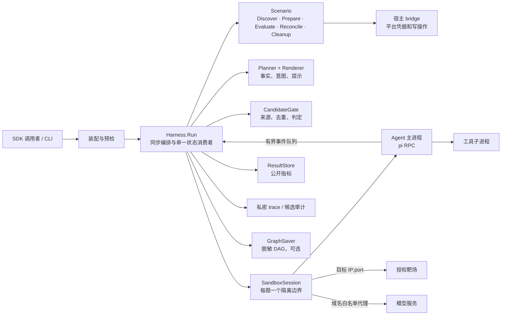
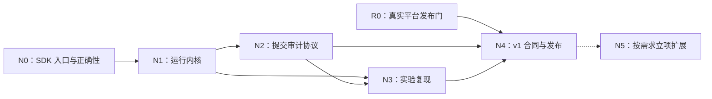

# Offensive Harness SDK：下一阶段架构与路线图

> 规划基线：2026-09-22。当前实现以 [architecture.md](architecture.md) 为准；v0.4 出口门以 [roadmap.md](roadmap.md) 为准。本文规划 v0.4 收尾及后续版本，不把尚未通过的发布门写成既成事实。

> 本次新增：[新架构设计](offensive-harness-sdk-architecture-next.md) 与本文 [N0–N5 实施路线](#6-新架构实施路线n0n5)。§2 保留当前运行架构，R0/R1 保留历史验收状态；N0–N5 是接下来的工程拆分。**N0.1–N0.4 已实现且离线出口门已逐条实测**（见 [N0 的落地状态](#n0-的落地状态2026-09-22)），**N0.5 按决定推迟**；不重复安排已落地的 R1。

## 1. 产品定位与决策

SDK 服务于**明确授权的 CTF、TSecBench 和本地靶场研究**。首要用户是编写 Scenario、Agent 或求解策略的开发者；CLI 是同一套 SDK 的参考装配和验收入口。一次 `Harness.Run(ctx, RunSpec)` 同步执行，题目串行，每题一个隔离容器与一个 Agent 会话。

短期目标是让一次运行可安全执行、可解释地结束、可复算地比较。通过率是研究指标；授权范围、隔离、凭据、清理和指标真实性是发布条件。任何阶段都不以 Fake 成绩或旧 `Executor` 测试替代生产装配路径的验收。

| 决策 | 理由 | 后续变化条件 |
|---|---|---|
| 宿主控制面是唯一可信决策者 | 平台 token、授权目标、提交与权威进度不交给 Agent | 远程 worker 需另设计身份与通信协议 |
| `Scenario.Prepare` 给出可达目标，宿主解析并冻结 IP:port | 调用者或 Agent 不能扩大出站范围 | 通用资产必须先有可验证的授权清单与时窗 |
| Agent 与工具同在每题 Docker sandbox | 工具调用天然继承隔离和清理边界 | 更换隔离后端须通过相同性质测试 |
| 公共指标与私密证据分开 | 统计可分享，原始 trace、候选与凭据不可误入公开面 | 新结果后端须遵循同一序列化契约 |
| v0.4 不做崩溃续跑、并发题目、Web 或远程 worker | 先验证单机闭环与语义，再扩大状态空间 | 分别进入独立设计与验收阶段 |

## 2. 当前架构基线

### 分层与依赖

1. **根包 `harness`** 定义 `RunSpec`、`RunResult`、错误类别及活跃端口；编排只依赖端口。`Scenario` 映射平台语义，`Sandbox` 管隔离与生命周期，`AgentFactory` 绑定既有 session，`Planner`/`Renderer`/`CandidateGate` 管求解状态，`ResultStore` 管公开结果。
2. **适配器**：`scenario` + `bridge` 处理平台，`executor` 实现 Docker sandbox，`piai` 实现 pi RPC，`dag`/`gate` 实现策略，`store` 实现文件结果与私密 trace。适配器依赖根包，根包不反向依赖具体实现。
3. **装配层 `local`**（`local/wire.go` 的包文档）是默认值与生产配置的单一入口。它从 `DefaultDockerConfig()` 构造隔离配置，注入跨进程锁、结果存储、策略工厂与可选图保存器；装配断言与 Docker 集成测试都必须走这条路径。直接调 SDK 也必须满足相同必需端口和锁契约。⚠️ N0.1 之后装配实现从 `internal/wire` 搬到了 `local/`——**`internal/wire` 只剩一个薄转发层，且当前没有任何 import 方**。搬家的理由是 Go 的 internal 可见性规则让 `internal/wire` 只能被本模块 import，于是仓库内的示例证明不了「外部可用」；`local` 因此在 `internal/` **之外**。

### 单题状态与副作用顺序

`Discover → Prepare → 冻结目标/配置 → NewSession → Probe → Launch/Start → [Next → Round → 消费屏障 → Gate → Evaluate → Reconcile] → Close Agent → Close Sandbox → Cleanup Scenario → Save Result`。

- `Run` 在任何平台或容器副作用前取得跨进程锁，并清理有标签的历史孤儿资源；取消先于预算和 provider 故障分类。
- 事件由有界队列传给唯一状态消费者。轮末屏障保证 Gate 和 DAG 看到完整的本轮事件后才提交候选。
- `observed`、`derived` 可提交，`fabricated` 不可提交；同一 Run 的同一候选不重复提交。平台写结果不确定时先 `Reconcile`，不能盲目重发。
- 平台权威进度决定是否解出；`State` 只描述运行如何结束，`Completed` 描述是否达成目标。清理和保存使用独立有界 context，清理错误另记，不覆盖主终态。

### 数据与信任边界

| 数据 | 所有者 / 落点 | 公共面规则 |
|---|---|---|
| 平台 token、provider key | 宿主 bridge / 受限传递；provider key 经临时 `0600` env-file 进入 sandbox | 不进入 `RunSpec`、argv、日志、结果 |
| 目标范围 | `Scenario.Prepare` 的权威目标，经宿主验证、冻结后交给 Sandbox | Agent、调用者不得附加白名单；默认拒绝其他出站 |
| 候选明文与原始 trace | 内存返回值及 `<ResultDir>/private/<runID>/`，目录 `0700`、文件 `0600` | 公开结果和脱敏 DAG 只含指纹、计数与枚举 |
| 公开结果 | `<ResultDir>/results/<runID>.json` | 只存结果、失败类别、成本、进度、配置摘要；不得直接序列化含 Flags 的 `RunResult` |
| 比较维度 | `ProfileDigest`、`BundleDigest`、model、scenario、challenge | bundle 内容变化须形成新实验分组；分母未知时召回率标记不可计算 |

Docker 宿主属于可信计算基。当前同一 Docker bridge 内流量不经过既有 iptables 规则，这一边界必须保留在部署文档和验收记录里；不能把当前隔离表述成对任意同桥容器也有效。

## 3. SDK 契约演进

**v0.4 保持现有生产入口**：`NewHarness(HarnessOptions)`、`Harness.Run(ctx, RunSpec)`、`Doctor(ctx)` 与独立 `ResultStore`。`Scenario`、`SandboxSession`、`AgentFactory` 等活跃端口以源码定义为准，不在收尾期为外观重写接口。

**v0.5 的契约整理已有离线实现**，迁移表见 [migration-v0.4-to-v0.5.md](migration-v0.4-to-v0.5.md)。下面保留原定范围，具体落地记录见 §4；下一轮新增变更见新架构设计 §3.3：

1. 将 `SolverProfile.Planner` / `PromptPolicy` 的任意 `map[string]any` 改为带 schema 与范围检查的配置；冻结后的有效值、bundle 内容摘要和 runner 镜像 digest 一起记录为运行清单。未知键、非法值和不可读 bundle 在副作用前失败。
2. 明确 `OutcomeView.Flags` 仅为内存/私密返回值；定义私密候选审计记录（指纹、来源、意图、提交时间、平台判定及明文的受限引用），避免只有原始 trace 而无法回答“提交了什么、结果如何”。审计记录与公开结果分别序列化。
3. 清理双代公开面：给 v0.3 `Engine`、`RunHandle`、`New`、`RegisterEngine`、`Store`、`EvidenceStore` 和旧 `Executor` 标注 legacy；若无生产调用方，在 v0.5 迁移窗口移出根包。保留既有 `Reason*` 字符串、图 schema 读取能力和 `answer.Fingerprint` 唯一实现。
4. 对齐 `GraphSaver` 的实际能力与文档：图是可选研究产物，保存失败要记录为可比较的阶段枚举；公开图须经过 DAG 的统一擦洗路径。不要把图保存成功误当成运行成功。

## 4. Roadmap 与出口门

以下按依赖排序；状态以**可复现证据**为准，不以代码存在为准。阶段时间取决于授权平台和 provider 可用性，因此不预设日历日期。

| 阶段 | 优先级 / 当前状态 | 交付项 | 退出条件 |
|---|---|---|---|
| **R0：v0.4 发布门收尾** | P0 / 未通过 | 定位 TSecBench `submit` 的 `app_error (http 501)`；真实 pi 完成授权题生命周期 | 经生产装配完成 `list → prepare → solve → submit → cleanup` 至少一题；平台权威确认提交结果；无残留；公开结果与私密证据正确。若 501 是平台故障，记录最小脱敏证据并保持门未通过 |
| **R1：v0.5 SDK 契约与审计** | P0 / **离线部分已落地（2026-09-22）**，依赖 R0 | profile schema、冻结运行清单、私密候选审计、legacy API 迁移、示例与迁移指南 | 编译期端口契约、配置拒绝用例、候选审计对账、公开面 canary 和旧图读取回归通过；CLI 与直接 SDK 调用同口径——**六条全部实测通过**（见下） |
| **R2：可重复研究基线** | P1 / 待开始，依赖 R1 | 固定题目集与采样规则、重跑清单、按题目交集比较、成本/召回率/完成率报表 | 相同配置可重建实验清单；分母未知与零轮 provider 故障不被报告为成功；可从公开结果复算指标；记录镜像与扩展包摘要 |
| **R3：v1 稳定授权靶场 SDK** | P1 / 待开始，依赖 R2 | 稳定核心接口、版本化迁移策略、Scenario 适配指南、隔离后端契约测试 | 至少 Fake 与 TSecBench 两个适配器通过同一合同测试；生产装配隔离、取消、故障和清理复测通过；发布文档与示例可从干净环境复现 |
| **R4：通用授权资产扩展** | 独立立项 / 不进入 v1 | 签名授权清单、目标与时窗校验、动作策略、完整审计、多人及远程 worker 威胁模型 | 单独安全设计与真实部署验收后再开放；不得复用靶场的隐式授权假设 |

### R1 的落地状态（2026-09-22）

六条出口条件逐条有实测证据，且**全部离线可验**：

以下为已有验收记录，本次设计未重跑这些测试。其覆盖范围不能外推为所有失败窗口均已处理：当前 `Outcome.Submitted` 计正确确认，审计计所有 Evaluate；审计写错误仍被忽略。N0/N2 会补齐故障可见性与全判定计数验收，不能把已有全成功用例的行数相等当成通用不变量。

| 出口条件 | 证据 |
|---|---|
| 编译期端口契约 | v0.3 的 41 个导出符号移出根包到 `legacy/`（叶子包）；`legacy/layering_test.go` 用 go/parser 扫全仓 import 图四条断言，已实测非空转（给 bridge 加一行 `_ ".../dag"` 会精确报出跨实现包的边） |
| 配置拒绝用例 | 未知键 / 类型错 / 越界 / 非法 `HintPolicy` 全部在**副作用之前**以 `KindConfig` 失败；已实测非空转（把校验挪到取锁之后 ⇒ 精确报出「取锁 1 次，期望 0」） |
| 候选审计对账 | `<ResultDir>/private/<runID>/submissions.jsonl` 行数与公开的 `submitted/duplicates/rejected` 逐项对得上；**生产装配路径实测**（integration 门真跑：审计文件存在、行数 == Submitted、公开结果不含明文 canary） |
| 公开面 canary | 既有 5 类 canary 全绿；新增字段（清单、审计计数、提交上限）各带闸：镜像引用与版本号各一份字符集闸、提示策略按穷举常量比对 |
| 旧图读取回归 | `dag/`、`answer/`、`gate/`、`v04.go` 在本轮**零 diff**（构造性证据）；`dag/testdata/` 两份 golden 字节未变；旧图读取用例（`TestLoadV0_2GraphJSON` 等）原样全绿 |
| CLI 与直接 SDK 同口径 | **实测两条路径逐字相同**：`profileDigest=d96751574f823ad8`、`bundleDigest=ab83809fda521ec9`、manifest 全字段一致。为此修掉两处真实口径差（部署级 bundle 不产生内容摘要；CLI 的 `--bundle` 顶掉默认 profile 而产生另一个 ProfileDigest） |

**R1 不改变发布边界**：R0 未通过期间不得据此发布 v0.5。迁移表见
`docs/migration-v0.4-to-v0.5.md`。

### N0 的落地状态（2026-09-22）

§6 列的 N0.1–N0.5，**前四项已实现，出口门逐条离线实测通过，命令与读数在下面**；
**N0.5 按决定推迟**（它不阻塞其余四项，且拓扑事实分级属于 analysis 侧的独立工作）。

| 出口条件 | 证据（均为 2026-09-22 实测） |
|---|---|
| N0.1 外部 go.mod 可编译并跑 Fake | `example/external/` 是独立 module（`replace` 指回仓库根，只有换 module 路径编译器的 `internal/` 可见性检查才真的开始工作）。`go build ./...` 退出 0；`FAKE_PROVIDER_API_KEY=<占位> go run . --scenario fake --image red-harness-external-stubpi:solve --provider fake-provider` 退出 0：体检 14 项全 ok，run 终态 `finished`、`solved`（1 轮、1 次提交），公开结果与私密审计各落一份 |
| N0.2 不同 StoreDir 双进程互斥 | `cmd/red-harness/lock_integration_test.go` 构建**真 CLI 二进制**并起两个（两个不同 `--store`、显式指向同一条 `--lock`）：第二个在回收之前失败，第一个正在跑的容器与网络原样在跑。它同时钉住「**修好扫描之后，锁第一次成为载荷**」（见下） |
| N0.3 两题图不覆盖 | 图落点改为**每题一份** `<StoreDir>/runs/<runID>/challenges/<题目 ID>/attempts/1/{graph.json,graph.mmd}`（路径由 `store.FileStore.ForAttempt` 拼，装配层不拼路径），`TestTwoChallengesKeepDistinctArtifacts` 钉住；旧路径 `<runDir>/graph.json` 由 `FileStore.ReadGraph` 回退读取，并如实报告 `GraphSourceLegacyRunRoot` 与 `GraphSourceChallenge` 的区别 |
| N0.4 审计写失败可见且不继续提交 | `TestAuditFailStopsRunAndKeepsConfirmedOutcome`：注入「只有审计失败、结果仍能写」时返回 `KindPersistence` 并**停止整次 Run**（`Run` 的题目循环遇 `KindPersistence` 即 `break`），本题标 `AuditIncomplete` 且**保留已确认成绩**（`Submitted` / `Flags` / `Score` 不清零）。错误链上带 `ErrAuditIncomplete` 哨兵，调用方不必解析消息 |
| N0.5 拓扑事实分级 | **推迟（未实现）**。`analysis/red-harness/extract_topology.py` 没有 active / legacy / unwired 分级字段（`topology.json` 的 `edges` 只有 `source`/`target`/`kind`），也没有只检查模式（脚本无参数解析，恒重写 `topology.json`）。本次不把「已有拓扑图」记成「分级已完成」 |

⚠️ **N0.2 的证据要连着读，否则会读反**：`ReclaimStale` 曾在生产路径上**完全空转**——
扫描用 `docker ps --format '{{json .Labels}}'`，而它打印的是一个**逗号拼接的字符串**、
不是 JSON 对象，于是每个对象都解析失败 ⇒ 归 `unparsable`，而判据里 `unparsable` 的
定义是「只报告，永不删除」⇒ 一件都不删、且完全静默。修在 `3d3d299`（改走 `docker inspect`
取结构）。**修好之前**那组「第一个进程的资源还在」的断言是**空转**的（回收根本删不掉
东西，资源当然还在）；**修好之后**「无锁的第二个进程会在启动时把第一个正在跑的容器
`docker rm --force` 掉」才是实测结论，而不是推理。也就是说：单运行锁这个设计是在
N0.2 修好之后**才第一次有了载荷**。这条同时是 owner 归属判据（`run + owner` 两条）
存在的理由——判据一旦真的会删，作用域算错就是删掉别人正在用的资源。

**N0 不改变发布边界**：R0 未通过期间同样不得据此发布。

### R0 的具体执行顺序

1. 在授权环境复核 `doctor`、镜像内 pi 版本、生产装配的网络默认拒绝与凭据 canary；保留目标可达、非目标不可达、代理白名单的正反探针。已有 2026-09-22 的 M2 证据作为基线，不替代本次发布配置核验。
2. 用已知最小请求复现 `submit` 501，记录脱敏 request ID、HTTP 状态、SDK 错误类别和平台权威进度；比较官方 SDK 的调用形状及平台契约，定位请求形状还是服务端状态。原始 flag 和 token 只进受限私密面。结果不确定时先对账。
   ⚠️ **读数要合起来看**：2026-09-22 复跑里 147 次 `POST /submit` 全部 200、501 未复现，但那次全程经 HTTP/1.1 中继——**直连路径仍未证**。所以既不成立「501 已经好了」，也不成立「submit 通了」。步骤与证据落点见 `docs/r0-runbook.md`。
3. 真实 pi 跑一题，确认 Agent 与工具都在 sandbox、平台确认结果、取消及失败后资源清零。`go test ./... -count=1`、`go test -race ./... -count=1` 与 Docker integration 全绿且无跳过；记录运行命令和证据位置。
4. 将 `architecture.md`、`roadmap.md`、`PLAN v0.4.md` 里与最新证据冲突的“待验收/已通过”表述统一，之后才标记 v0.4 完成。

## 5. 明确的边界与风险

- **授权与隔离**：靶场平台给出的目标是当前授权来源；此假设不能外推到真实资产。生产装配曾因配置零值关闭隔离，后续必须同时验证适配器与装配路径。
- **平台不确定性**：真实运行已到工具调用与目标访问，但 `submit` 曾返回 501；尚不能推定是请求错误或平台故障，也不能宣称完成真实提交闭环。
- **实验可比性**：profile 路径摘要不等于 bundle 内容摘要；模型、题目和起跑剩余量不同的结果不能直接比较通过率或召回率。
- **范围控制**：v1 仍是 Linux + Docker、单机单用户、题目串行和文件后端。并发、恢复、Web、数据库与远程执行需要单独状态模型与威胁模型。

## 6. 新架构实施路线（N0–N5）

建议先交付 **外部可用且资源、审计语义正确的 SDK**，再完成内核拆分和实验能力。R0 是真实平台发布门，N0–N3 的离线工程可以在等待平台环境时开展；后续正式发布仍须通过 R0。没有实际实现和验收前，下面的阶段均为“待开始”。

对应关系：R0 继续收尾；R1 不重做；R2 由 N1–N3 支撑；R3 的稳定 SDK 出口由 N4 承担；R4 的通用授权资产扩展仍独立立项。版本号是规划分组，只有出口门通过才打标签。

| 阶段 | 建议版本 / 优先级 | 具体产物 | 可判定的出口门 | 估算投入 |
|---|---|---|---|---|
| N0 SDK 入口与正确性 | v0.5 收尾 / P0 | `local` 公开装配、仓外示例、锁与回收作用域修正、每题图路径、审计失败可见性 | 外部 go.mod 可编译并跑 Fake；不同 StoreDir 双进程互斥；两题图不覆盖；审计写失败可见且不继续提交 | 1–2 人周 |
| N1 运行内核模块化 | v0.6 / P0 | 同包拆分 `v04.go`、challengeSession、显式 finalizer、SolverFactory、版本化事件合同 | 取消与故障终态保持；重启不串事件；所有队列有界；CLI / SDK 有效配置同源；旧合同适配测试通过 | 2–3 人周 |
| N2 提交审计协议 | v0.6 / P0 | 显式 AuditStore、operationID、多阶段持久化、公开计数新 schema、旧审计 reader | 四个写入窗口故障注入通过；无盲目重提；未知状态不算判错；按 operationID 对账 | 1–2 人周 |
| N3 可重复实验 | v0.7 / P1 | bundle 快照、固定镜像、ExperimentManifest、顺序批次与配对比较、离线 replay | 执行身份与 manifest 一致；同一清单可重新执行；不可比样本与失败分母可解释；公开结果可复算 | 2–3 人周 |
| N4 v1 稳定合同 | v1.0 / P1 | `harnesstest`、独立消费样例、适配指南、版本与 schema 策略、发布证据包 | R0 通过；Fake/TSecBench 合同一致；第二种 Agent 验证通用事件合同；生产 Docker 门无跳过；干净环境复现 | 1–2 人周 |
| N5 扩展 | 不承诺版本 / P2 | 并发、恢复或授权资产 RFC，由明确需求触发 | 各自通过所有权、状态与授权设计评审及专项验收 | 独立估算 |

估算假设：一位熟悉现有代码的 Go 工程师、一个可用 Docker 测试环境，不包含平台等待、第二种生产 Agent 的完整接入与外部服务修复。N0–N4 合计约 7–12 人周，为排期初值；N0 完成后按实际变更量重估。模块责任见下表，不预设人员分工或自动并行实施。

### N0：先让 SDK 在仓库外成立

建议按下面的独立变更合并，每项都有自己的回归证据：

| 工作项 | 主要修改位置 | 验收与回退 |
|---|---|---|
| N0.1 发布默认装配 | 新 `local/`，`internal/wire/`、`internal/cli/`、`example/`、layering 测试 | 在仓外临时模块构建并运行示例；保留旧 wire 薄转发一轮；CLI 改显式工厂注入，消除包级 SetWire |
| N0.2 统一锁与回收身份 | `local` 锁配置、`executor` 标签/回收、根包启动逻辑 | 同 daemon 不同目录的两个真实进程，第二个不能进入 Prepare/Reclaim；不属于该 owner 的资源不可删除；旧资源无法证明归属时只报告 |
| N0.3 每题产物可寻址 | `dagGraphSaver`、`store` 路径和 reader | 一次 Run 两道题生成两组图；旧路径继续可读；取消后产物状态可见；不尝试补造已覆盖的历史图 |
| N0.4 审计故障可见 | `appendAudit`、结果 schema 与 canary | 注入“只有审计失败、结果仍能写”情形，返回持久化错误并停止后续提交；结果保留已确认成绩和 audit incomplete |
| N0.5 拓扑事实分级 | analysis 提取器、文档入口、接线合同 | 区分 active / legacy / unwired；记录测试与 revision；新增只检查模式；不以 regex 命中替代运行验证 |

N0 不等待 N2 完整操作日志才能修“吞审计错误”。其最小修复只改变后续是否继续发送及失败可见性，不假装已经补上崩溃前的持久化窗口。

### N1：拆职责，同时固定运行语义

1. 先无行为变更地拆出配置、轮循环、事件与收尾文件，保留根包零子包依赖；既有理由枚举、退出码、图 schema 与指纹格式保持。
2. 引入 challengeSession 及统一 finalizer；覆盖 Prepare 部分成功、Agent 启动失败、轮内取消、保存失败与清理超时。总清理预算有界，后续资源仍得到清理机会。
3. 用 SolverFactory 统一每题 Planner / Renderer / Gate 所有权；以适配层承接旧工厂，移除 wire 活图登记旁路前先证明各题快照等价。
4. 升级事件合同：带上下文的写入、session epoch、轮次与序号屏障。测试慢消费者、事件超限、迟到事件与重启预算累计。

出口不以代码行数下降计：变更后实际行为必须能由状态机、端口合同和故障矩阵解释。把一个大文件机械分成几个文件，只能完成第 1 项。

### N2：审计记录与平台副作用对齐

依次交付发送前 `prepared` / `dispatching`、回执落盘、uncertain 对账、公开计数 schema 与迁移 reader。写入失败是关键路径错误；图导出仍是可选辅助产物。

验收至少覆盖：发送前磁盘失败导致 Evaluate 调用数为 0；远端已处理但断连后不自动重发；拿到回执后审计失败保留已知成绩；崩溃后 dispatching 记录保守显示 uncertain；平台只提供总进度时不把增量归给某个候选。

迁移 reader 不重写旧文件。新 writer 写显式 schemaVersion；旧单行审计只能提供历史结果，不能用于证明发送前持久化。公开 attempts / accepted / rejected / uncertain 的完整性可单独标记，旧 submitted 值保留原含义。

### N3：让研究结论可以复算

先冻结实际执行内容，再做报表，避免精确比较错误分组：

1. EffectiveSpec 统一默认值；实际挂载 bundle 快照；容器启动绑定固定镜像；公共 manifest 不收凭据、原始提示或本机敏感路径。
2. ExperimentManifest 固定题目集合、顺序、预算、重复次数、场景初态与所有实现版本；每个条目记录执行或未执行的原因。
3. `experiment` 只顺序调用 Runner；输出完成率、增量召回率、基础设施失败率、成本与提交效率。分母未知为 null；只比较题目和起跑状态匹配的样本。
4. 用受限事件夹具验证 DAG/Gate/停止策略重放。模型、工具、平台写操作都不在 replay 中执行；结果标为离线策略分析。

验收固定一份至少包含已解、未解、provider 故障、未知目标总数、提交 uncertain 的离线数据集，公开结果计算与预期逐项一致。授权真实实验另存证据，不把固定数据集的正确统计当成能力提升。

### N4：以第三方接入和生产证据冻结 v1

将 Scenario、Agent/Sandbox、事件、结果后端的合同测试提供给外部模块。对 Fake 和 TSecBench 使用相同合同，后者的平台部分在授权环境执行；再以一个独立于 pi 帧解析的最小 Agent 适配器验证 runtime 信息与事件协议的通用性。测试适配器通过不代表第二种生产 Agent 已支持。

发布包必须包含：版本与迁移指南、公开 API 清单、schema 读写矩阵、生产装配图、运行 manifest、测试命令与 PASS/FAIL/SKIP 数、平台确认回执的脱敏证据、资源清理结果，以及未验证的边界。R0 的直连提交确认与同桥隔离边界分别记录，不能合并成一个“网络已通过”。

N1/N2 的接口方法集变更在明确的 pre-v1 版本集中交付，提供旧接口适配器和弃用窗口；v1 之后的破坏性 API 变更另开 major。文件 schema 独立版本化，历史数据可读性不随 Go API 清理而消失。

### N5：有需求再扩大运行模型

| 方向 | 启动条件 | 必须先解决的问题 |
|---|---|---|
| 同机并发题目 | 已测得串行吞吐成为研究瓶颈 | 平台配额、独立网络、租约表、回收 fencing、每题存储与预算隔离 |
| 崩溃恢复 | 用户需要恢复长实验，且重跑成本有证据 | 平台操作回执、持久化恢复点、会话可恢复性；重放状态不等于重做外部写操作 |
| 第二隔离后端 / 远程 worker | 单机 Docker 无法满足已确认部署需求 | worker 身份、凭据分发、授权范围、网络策略、连接断开后的资源所有权 |
| 通用授权资产 / 多 Agent | 有超出 CTF 的具体场景与目标模型 | 授权清单与时窗、动作策略、Finding / Evidence 模型、跨 Agent 预算和提交仲裁 |

下一项实施建议为 **N0.1**，紧接 **N0.2 与 N0.4**：先提供可复用入口，再保证这条入口不会跨目录误回收资源或隐藏审计失败。R0 环境验证继续按 [runbook](r0-runbook.md) 单独推进。
